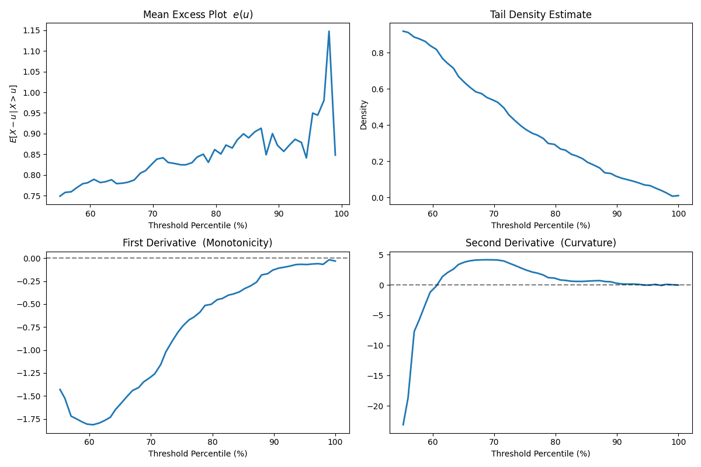
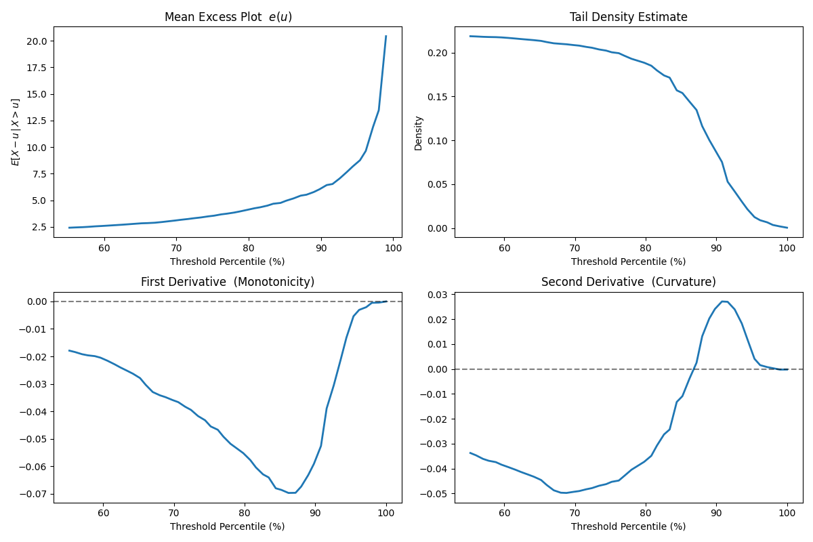
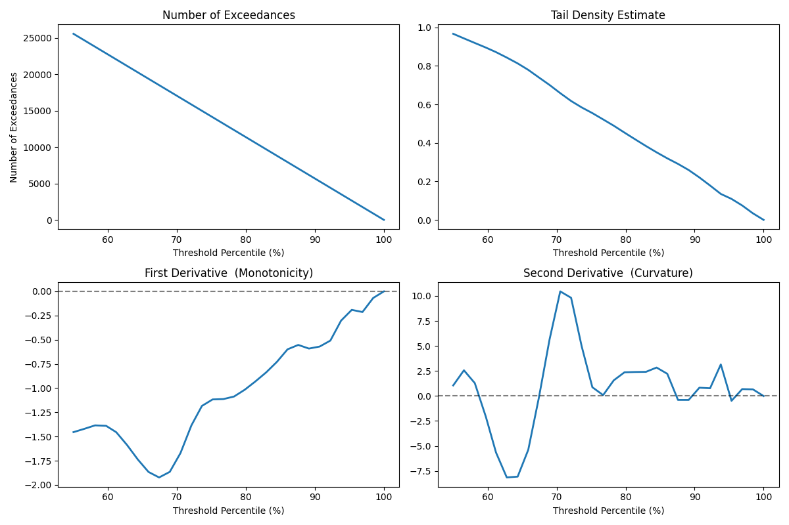

# Tail Diagnostics for Threshold Selection

## Motivation

In our distributionally robust tail estimation framework, the parameter `a` specifies the onset of the *tail region* — that is, the point beyond which the distribution is assumed to satisfy the geometric shape constraints used in the DRO formulation. This plays the same conceptual role as the threshold in classical peaks-over-threshold extreme-value analysis.

A key practical concern raised by the reviewer is:

> How should the tail threshold `a` be selected in a principled, data-driven manner?

If `a` is chosen too small, the assumed tail structure may not yet hold.  
If `a` is chosen too large, too few tail points remain for reliable inference.

To address this transparently, we provide a set of diagnostic tools ([drovt.utils.tail_diagnostics](droevt/utils/tail_diagnostics.py)) that allow the analyst to visually assess the point at which the tail behavior begins to stabilize.

--- 

## Diagnostic Tools

Given a dataset $x_1,\dots,x_n$, the module evaluates a grid of candidate thresholds and computes the following quantities.

### Mean-Excess Function

$$
e(u)=\mathbb{E}[X-u \mid X>u].
$$

Approximate linearity of $e(u)$ is the classical indicator of generalized Pareto-type tail behavior.

### Tail Density Estimate and Derivatives

A kernel density estimate is computed over the tail region.  We then numerically evaluate:

- the first derivative (monotonicity)
- the second derivative (curvature)

after mild smoothing to stabilize numerical noise.

These plots allow the analyst to examine whether the tail behaves as theoretically expected:

| Property                | Diagnostic                         | Interpretation                                     |
|-------------------------|------------------------------------|----------------------------------------------------|
| Decreasing tail         | 1st derivative < 0                 | The tail density decays monotonically              |
| Convex tail curvature   | 2nd derivative consistently > 0    | The tail becomes convex, consistent with geometric-type tails |

---

## How These Plots Are Used

We recommend choosing the smallest threshold `a` such that:

1. the estimated tail density decays smoothly  
2. the curvature stabilizes and no longer oscillates erratically  

This mirrors established practice in EVT: the goal is not to recover a unique “true threshold,” but to
identify a stable tail regime in which model assumptions are credible. Choosing a larger threshold
typically increases robustness to model misspecification (since the tail is cleaner), but reduces the
effective sample size and increases estimation variance. The diagnostics therefore help the analyst
balance this conservativeness-variance trade-off in a transparent way.

# Examples

Below we illustrate the diagnostics for several benchmark distributions.

### Diagnostic Examples

<table>
  <tr>
    <td>

**Example 1 — Gamma (Light Tail)**  
<br>


</td>
<td>

**Example 2 — Lognormal (Sub-Exponential Tail)**  
<br>


</td>
<td>

**Example 3 — Pareto (Heavy Tail)**  
<br>


</td>
<td>

**Example 4 — Seismic Magnitudes (CMT Data)**  
<br>


</td>
  </tr>
</table>

### Interpretation

The purpose of these plots is not to assume a particular parametric tail
model, but rather to assess whether the empirical tail behaviour has entered
a stable regime. In our framework, the threshold `a` marks the point beyond
which the geometric tail constraints used in the DRO formulation are intended
to apply. Choosing `a` too low risks including non-tail behaviour, while
choosing it too high reduces the amount of usable data.

The diagnostics therefore provide complementary perspectives on tail stability:

• The **mean-excess curve** shows how the expected overshoot behaves as the
threshold increases. Although this plot has classical EVT roots, we do not
use it to justify a generalized Pareto model. Instead, we treat it as an
exploratory tool: when the curve transitions from unstable to qualitatively
regular behaviour, this suggests the onset of a tail regime.

• The **tail density estimate** indicates whether the right-tail becomes
smoothly decreasing beyond a candidate threshold.

• The **first derivative** highlights whether the decay rate stabilizes
(i.e., whether oscillations or reversals in monotonicity disappear).

• The **second derivative** helps identify whether the curvature settles
into a consistent pattern rather than fluctuating between convex and
concave regions.

Across these examples, a common pattern emerges. At moderate quantiles
(around the 65–75% range), the diagnostics begin to stabilize:

- the estimated tail density decays smoothly  
- the first derivative remains consistently negative  
- the second derivative stops oscillating and settles into a stable sign  

This marks the onset of the region where tail behaviour becomes structurally
stable.

In our empirical work, we therefore select the threshold `a` near the
**70th percentile of the data**, representing the smallest value for which tail
behaviour appears stable across all diagnostics. Choosing smaller thresholds
risks violating tail assumptions, while choosing much larger thresholds
discards data and increases variance.

<details>
<summary><strong style="text-decoration: underline; cursor: pointer;">Code Snippet: Generating Tail Diagnostics for Synthetic and Real Data</strong></summary>

```python
import matplotlib.pyplot as plt
import importlib
import droevt.utils.tail_diagnostics
importlib.reload(droevt.utils.tail_diagnostics)


from scipy.stats import gamma, lognorm, pareto, genpareto, truncnorm
import logging

logging.basicConfig(level=logging.INFO)
logger = logging.getLogger(__name__)

import droevt.utils.synthetic_data_generator as data_utils

data_size = 500

random_seed = 20220222

data_module_map = {"gamma": gamma,
                   "lognorm": lognorm,
                   "pareto": pareto,
                   }
meta_data_dict = {"data_size": data_size}
data_sources = ["gamma", "lognorm", "pareto"]
for data_source in data_sources:
    print(data_source)
    data_module = data_module_map[data_source]
    data_param_dict = data_utils.DISTRIBUTION_DEFAULT_PARAMETERS[data_source]
    meta_data_dict['random_state'] = random_seed
    x = data_utils.generate_synthetic_data(data_module, 
                                           data_param_dict, 
                                           meta_data_dict['data_size'], 
                                           meta_data_dict['random_state'])
    output_dict = droevt.utils.tail_diagnostics.plot_tail_diagnostics(x, 
                                                                      data_source=(data_source, data_param_dict))
    plt.show()

from experiments.input_data.cmt.parse_script import parse_ndk

df = parse_ndk()
x = df.loc[:, 'Mw'].values
droevt.utils.tail_diagnostics.plot_tail_diagnostics(x, data_source=('cmt', {}))
plt.show()
```

</details>