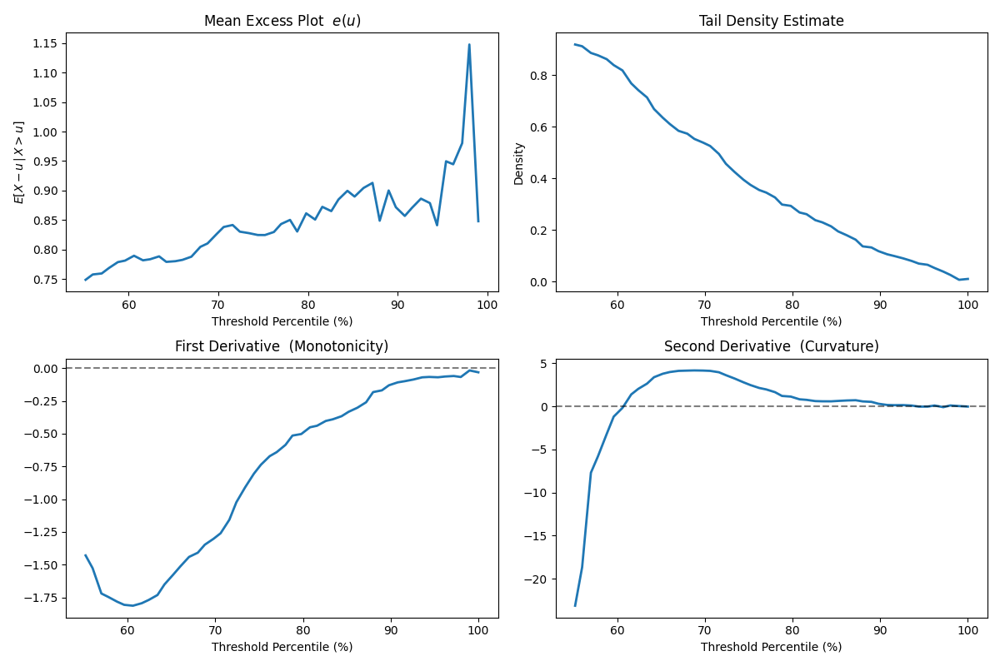
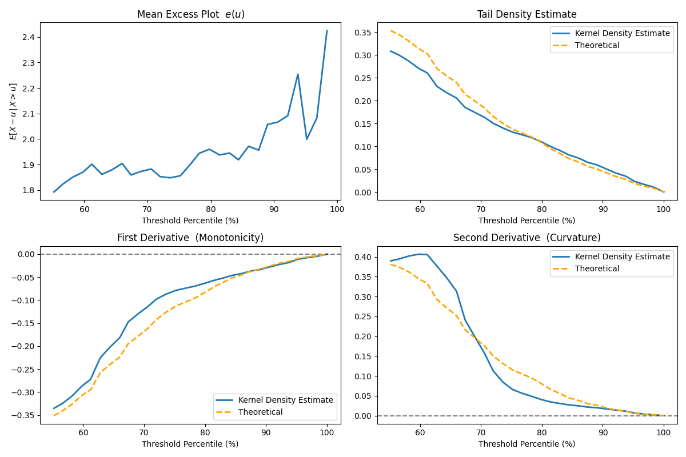
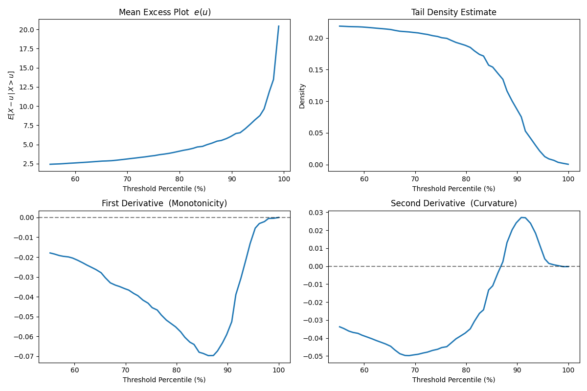
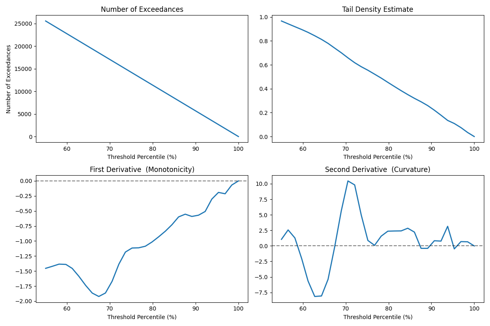

# Tail Diagnostics for Threshold Selection

## Motivation

In our distributionally robust tail estimation framework, the parameter `a` specifies the onset of the *tail region* — that is, the point beyond which the distribution is assumed to satisfy the geometric shape constraints used in the DRO formulation. This plays the same conceptual role as the threshold in classical peaks-over-threshold extreme-value analysis.

Specifically, there is a tradeoff that:

- If `a` is chosen too small, the tail geometry may not yet hold.  

- If `a` is chosen too large, too few exceedance observations are available for reliable calibration of the parameters in the DRO constraints

To address this transparently, we provide a set of diagnostic tools ([drovt.utils.tail_diagnostics](droevt/utils/tail_diagnostics.py)) that allow the analyst to visually assess the point at which the tail behavior begins to stabilize, and moreover assess the tail geometry to be used.

--- 

## Diagnostic Tools

Given a dataset $x_1,\dots,x_n$, the module evaluates a grid of candidate thresholds and computes the following quantities.

### Number of Exceedances

For each candidate threshold $u$, we compute the number of data points exceeding $u$:

$$
N(u) = \sum_{i=1}^n \mathbb{I}(x_i > u).
$$

This diagnostic helps assess whether there are sufficient data points above the threshold for reliable estimation and calibration of the moment constraints.

### Tail Density Estimate and Derivatives

Using kernel methods, we estimate:

- the first derivative (for checking monotonicity)

- the second derivative (for checking convexity)

These plots allow the analyst to examine whether, and how, the tail behaves for using the DRO formulation:

| Property                | Diagnostic                         | Interpretation                                     |
|-------------------------|------------------------------------|----------------------------------------------------|
| Decreasing tail         | 1st derivative consistently < 0                 | The tail density decays monotonically              |
| Convex tail   | 2nd derivative consistently > 0    | The tail density becomes convex |


---

## How These Plots Are Used

We recommend choosing a threshold `a` such that:

the estimated tail density decays smoothly  and if the first derivative stabilizes (i.e., no longer oscillates erratically) and is negative, then we use $\mathcal P^1(a)$ as the geometric constraint, i.e., density decreasingness. If in addition the second derivative stabilizes (i.e., no longer oscillates erratically) and is positive, then we use $\mathcal P^2(a)$ as the geometric constraint, i.e., density decreasingness. and convexity.

# Examples

Below we illustrate the diagnostics for several benchmark distributions.

### Diagnostic Examples

<table>
  <tr>
    <td>

**Example 1 — Gamma (Light Tail)**  
<br>


</td>
<td>

**Example 2 — Lognormal (Sub-Exponential Tail)**  
<br>


</td>
<td>

**Example 3 — Pareto (Heavy Tail)**  
<br>


</td>
<td>

**Example 4 — Seismic Magnitudes (CMT Data)**  
<br>


</td>
  </tr>
</table>

### Interpretation

The purpose of these plots is to guide the selection of `a', which is the threshold beyond
which the geometric tail constraints used in the DRO formulation are intended
to apply. Choosing `a` too low risks including non-tail behavior, while
choosing it too high reduces the amount of usable data. 

The diagnostics include:

- The **number of exceedances** shows how many data points are above each candidate threshold. We suggest selecting a threshold with at least 20 observations above it, so that there are sufficient observations for reliable calibration of the auxiliary moment constraints.

- The **tail density estimate** shows the density estimate at each candidate threshold, and helps visualize whether the right-tail is smoothly decreasing beyond a candidate threshold.

- The **first derivative** shows the estimate of the first derivative of density at each candidate threshold, and helps visualize whether the density derivative stabilizes (i.e., no oscillations between positive and negative), and also whether it is negative. If so, density decreasingness can be used as geometric constraint.

- The **second derivative** shows the estimate of the second derivative of density at each candidate threshold, and helps visualize whether the density's second derivative stabilizes (i.e., no oscillations between positive and negative), and also whether it is positive. If so, density decreasingness and convexity can be used as geometric constraint.

Across these examples, a common pattern emerges. At moderate quantiles
(around the 65–75% range), the diagnostics begin to stabilize in that:

- the estimated tail density decays smoothly  
- the first derivative remains consistently negative  
- the second derivative stops oscillating (if it happens at smaller quantiles) and becomes consistently positive

This marks the onset of the region where tail behavior becomes stable and follows our geometric constraint of density decreasingness and convexity.

In our empirical work, we therefore select the threshold `a` near the
**70th percentile of the data**, representing a value for which tail
behavior appears stable and satisfies our geometric constraint across all diagnostics. Choosing lower thresholds
risks violating tail assumptions, while choosing much larger thresholds
discards data and increases variance.

<details>
<summary><strong style="text-decoration: underline; cursor: pointer;">Code Snippet: Generating Tail Diagnostics for Synthetic and Real Data</strong></summary>

```python
import matplotlib.pyplot as plt
import importlib
import droevt.utils.tail_diagnostics
importlib.reload(droevt.utils.tail_diagnostics)


from scipy.stats import gamma, lognorm, pareto, genpareto, truncnorm
import logging

logging.basicConfig(level=logging.INFO)
logger = logging.getLogger(__name__)

import droevt.utils.synthetic_data_generator as data_utils

data_size = 500

random_seed = 20220222

data_module_map = {"gamma": gamma,
                   "lognorm": lognorm,
                   "pareto": pareto,
                   }
meta_data_dict = {"data_size": data_size}
data_sources = ["gamma", "lognorm", "pareto"]
for data_source in data_sources:
    print(data_source)
    data_module = data_module_map[data_source]
    data_param_dict = data_utils.DISTRIBUTION_DEFAULT_PARAMETERS[data_source]
    meta_data_dict['random_state'] = random_seed
    x = data_utils.generate_synthetic_data(data_module, 
                                           data_param_dict, 
                                           meta_data_dict['data_size'], 
                                           meta_data_dict['random_state'])
    output_dict = droevt.utils.tail_diagnostics.plot_tail_diagnostics(x, 
                                                                      data_source=(data_source, data_param_dict))
    plt.show()

from experiments.input_data.cmt.parse_script import parse_ndk

df = parse_ndk()
x = df.loc[:, 'Mw'].values
droevt.utils.tail_diagnostics.plot_tail_diagnostics(x, data_source=('cmt', {}))
plt.show()
```

</details>